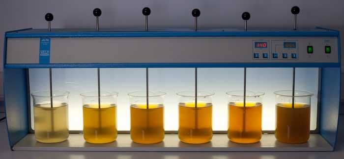
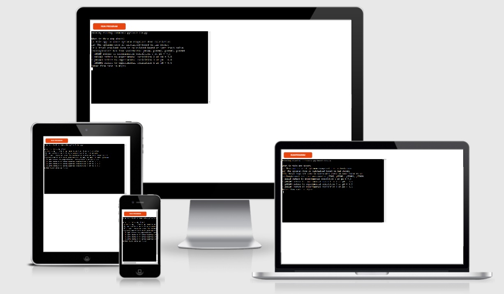
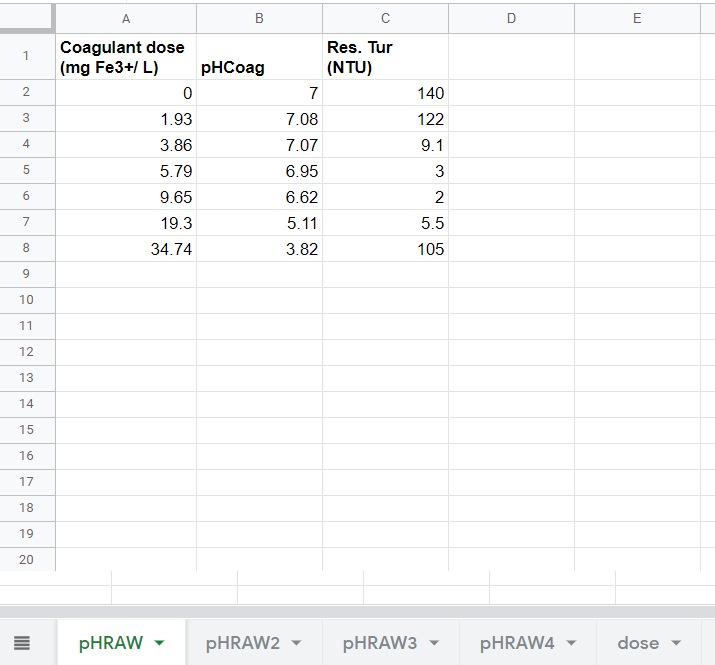
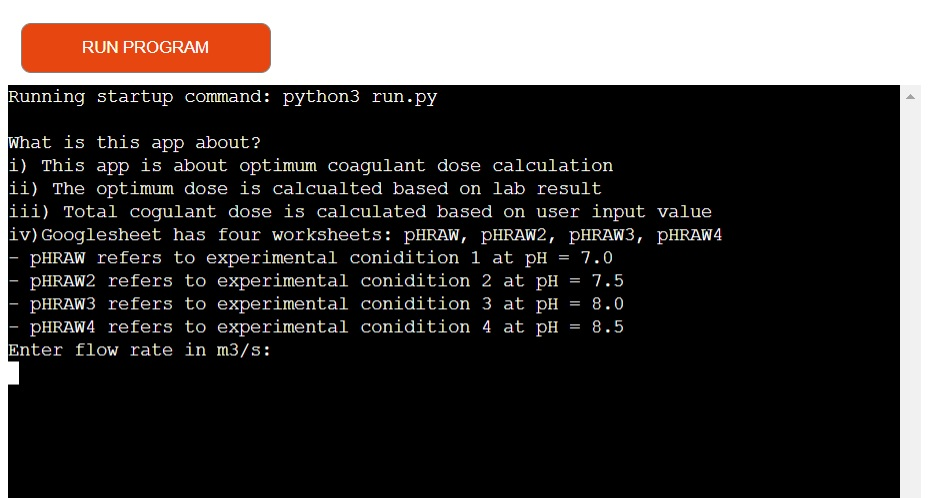
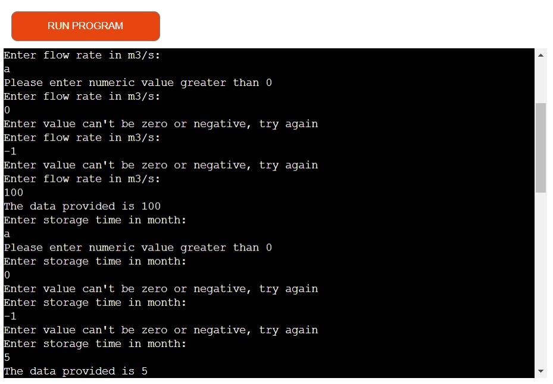
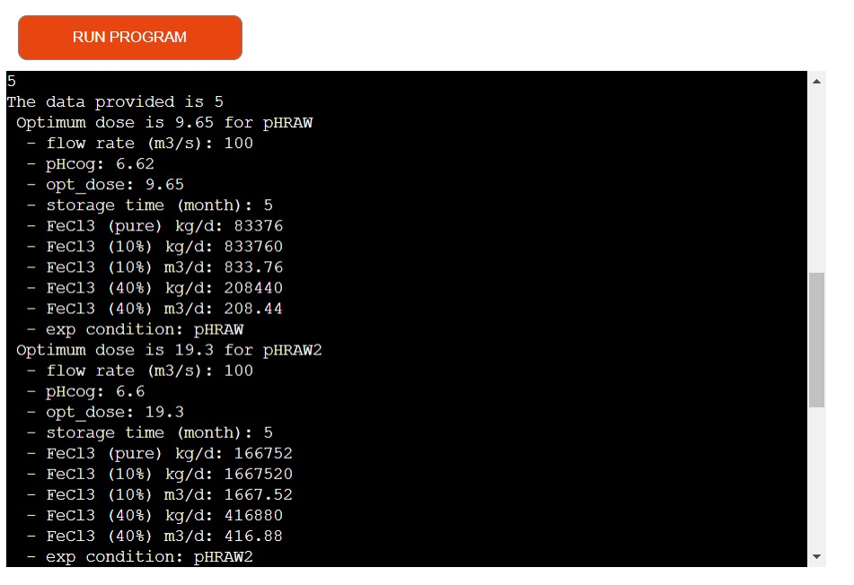
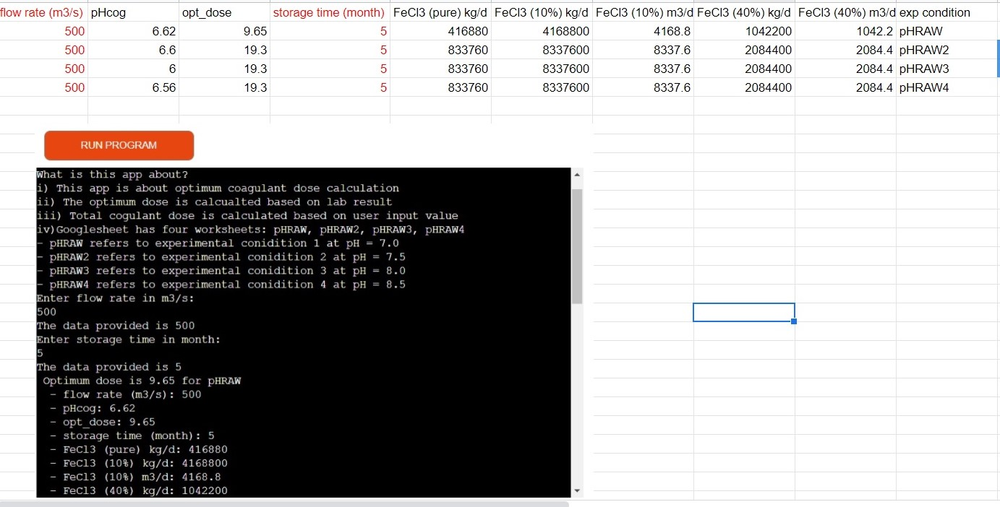
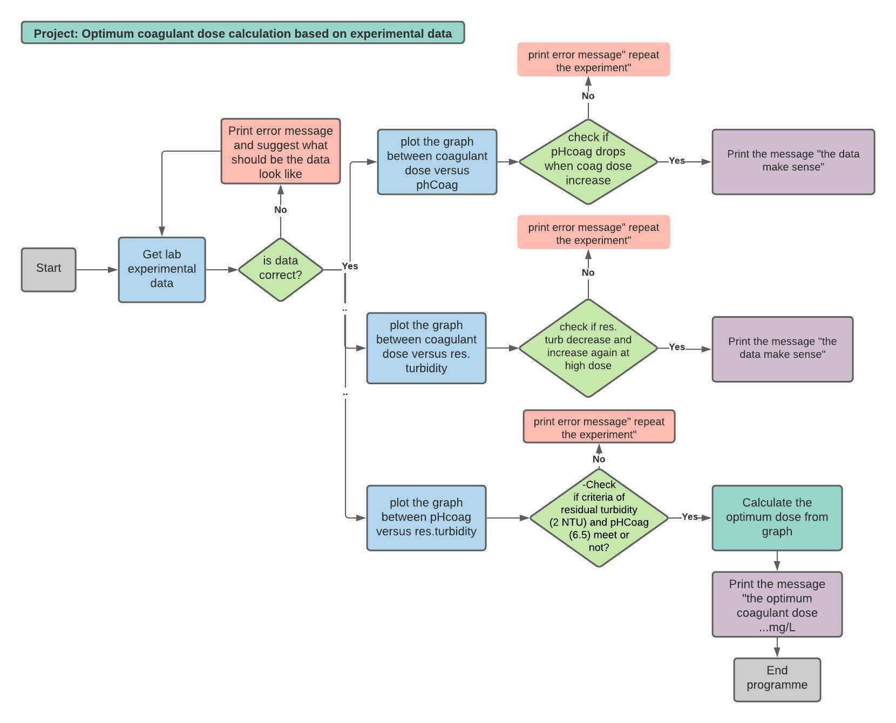
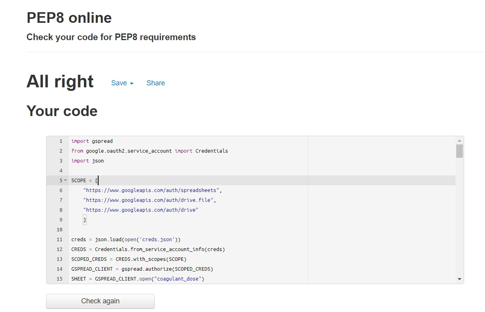

# Calculator optimum coagulant dose
Welcome! [IHE Delft](http://un-ihe.org)
## Introduction
Coagulation is a general treatment method to remove suspended fine particles, colour and other constituents from raw water, after adding chemicals (coagulants) and followed by further treatment. Coagulation is often applied in both conventional and advanced water treatment processes for the production of drinking water. 

Theoretical calculation of the optimum coagulant dose is not possible. Therefore, for each raw water experiments are needed. In glass beakers the coagulation process (rapid mixing, flocculation and sedimentation) is performed as shown in Fiure. This bench scale test is the so called “Jar test”. 

The overall aim of this project is to make an app which allows to analyze the google sheet data generated from the lab jar test experiments and calcualte the optimum coagulant dose. The app also allows the users to eneters the some plant operational data to calculate the total coagulant dose needed.

A live app can be found [here](https://coagulant-dose-calculator.herokuapp.com/).

# Table of Contents
 [1. About the coagulant calculaor app](#coagulant-app)

 [2. How does the app works?](#play-app)

 [3. Features](#features)
 - [Existing features](#exist-feature)
 - [future features](#future-feature)

 [4. User Expereince (UX) design](#ux)
  - [User Goals:](#user-goals)
  

 [5. Flow chart](#flow-chart)

 [6.Technologies used](#technologies-used)

 [7.Testing](#testing)

 [8.Bugs](#bugs)

 [9. Deployment](#deployment)

 [10. Acknowledgement](#acknowledgement)

  
# 1. About the coagulant calculaor app
  [Go to the top](#table-of-contents)

  
# 2. How does the app works?
  [Go to the top](#table-of-contents)

  
# 3. Features
  [Go to the top](#table-of-contents)

## Existing Feature
- App calcualtion is linked to the google sheet data. The google sheet access is given using google API.
- Google sheet has four worksheet named phRAW, pHRAW2, pHRAW3, pHRAW4 where mainly the experimental data at differnt conditions are stored.The sheet also has worksheet name "dose" where mainly the data calcualted by app based on user input data will be stored.
- App check the data input validation in the google sheet 

- Explain what the app is about 
- App ask user input data 

- User data validation and error checking
  - Users has to enter either float or integer 
  - data input cannot be zero or negative
  - data input must be number

- App calcualtion
  - App calcualte the optimum coagulant dose for all experimental conditions
  - Based on the optimum dose calculated and user's input data, app calcualte the coagulant dose needed for differnt types of coagulants used

-Google data sheet update
  - user's input data and app calcualted data is updated in the new row in the google sheet

## Future Feature
 - Allow users to select option for choosing differnt coagulants types
 - Allow users to have the design dimentions for coagulation units

   
# 4. User Expereince (UX) design
  [Go to the top](#table-of-contents)

  Dosing of coagulant (chemical) i.e. FeCl3 is needed to remove the fine particles from drinking water treatment. Moreover, overdosing of the chemicals will support for the resuspension of partcles and is also an environmental issues. Therefore, optimization of the coagulant dose based on the water qaulity is rather important which save cost and environment. This project is aimed to design the app which allows to calcualte the optimum coagulant dose based on the experimental data provided in google sheet and ultimately calcualte the total dose required depending upon the type of coagulant used. 

The following users types can be benifitted from the app:

- Drinking water treatment plant operators
- Professionals dealing with water treatment designs.
- Post graduate students in the field of water supply and environmental engineering.

   
## 4.1 User Goals
  [Go to the top](#table-of-contents)

The main goal of this project is to develop a coagulant dose calcualtor app that allows to calcualte the optimum coagulant dose for diffent water types. This is of great useful for me to apply in my teaching for a demonstration in the laboratory session to my students.

 
# 5. Flow Chart
  [Go to the top](#table-of-contents)

Flow chart was used to conceptualise the optimum coagulant dose calcualtor idea. It was drawn using Lucid Chart. The flow diagram is as shown below.

 
# 6. Technologies-used
  [Go to the top](#table-of-contents)

* [Python3](https://en.wikipedia.org/wiki/Python_(programming_language)) was used as a scripting language for the app development in this project.

* [Lucid Chart](https://www.lucidchart.com/) was used to flow diagram for the app.

* [Github](https://github.com/) was used to create the repository and to store the cproject's code after pushed from Git.
* [Gitpod](https://www.gitpod.io/) was used as the Code Editor for the site
* [PEP8 online](http://pep8online.com/) tool was used for manual testing procedures for code validation.

* [Ami](http://ami.responsivedesign.is/) was used to develop a Mockup screenshot generator
* [Heroku](heroku.com) was used to deploy a final version of the Python Essentials application code.

# 7. Testing
  [Go to the top](#table-of-contents)

## PEP8 online validation
  I have tested this project manually by passing the code through PEP8 online validation tool wand confirmed there are no errors. The screenshot is as shown below:
  
## Mannual testing 
## a) Google sheet
TEST            | OUTCOME                          | PASS / FAIL  
--------------- | -------------------------------- | ---------------
Google sheet | checked if the data in the google sheet is not a float number except table heading, it gives an error message "Data is not valid ! Please check the data entry".| PASS

## b) User input 
TEST            | OUTCOME                          | PASS / FAIL  
--------------- | -------------------------------- | ---------------
User input | checked if the data provided by user is not either integer or float or positive, it gives an error message "Please enter numeric value greater than 0" and "Enter value can't be zero or negative, try again" until the correct input is given| PASS
Update google sheet | checked if the data in google sheet is updated or not based on the users input and app calcualtion| PASS
Update google sheet | checked if the new data in google sheet is updated in the new row or not after each input from the user| PASS

# 8. Bugs
  [Go to the top](#table-of-contents)

 
# 9. Deployment
  [Go to the top](#table-of-contents)

  The proejct was deployed to Heroku using the following steps:
- Sign up to Heroku
- 

# 10. Acknowledgement
  [Go to the top](#table-of-contents)

* Inspired from love sandwitch project from the code institute course
* Thanks to my mentor Marcel Mulders for his constructive feedback

